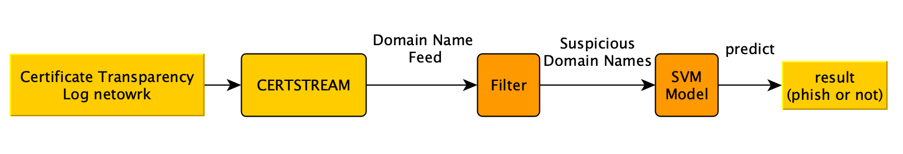
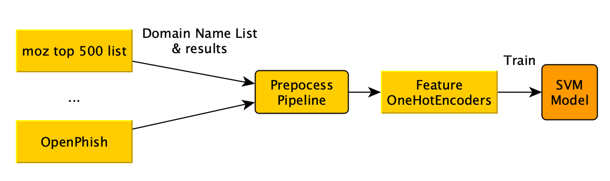
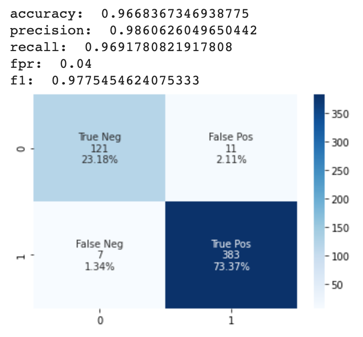

# Phishing Domain Scanner

## Background:
Detecting phishing websites is not easy because of the use of URL obfuscation to shorten the URL, link redirections and manipulating links in such a way that it looks trustable and the list goes on. This necessitated the need to switch from traditional programming methods to machine learning approach.

Traditionally, the ad-hoc methods have been used to detect phishing attacks based on content, URL of the webpage, etc. There are primarily three modes of phishing detection²:
Content-Based Approach: Analyses text-based content of a page using copyright, null footer links, zero links of the body HTML, links with maximum frequency domains. Using only a pure TF-IDF algorithm, 97% of phishing websites can be detected with 6% false positives.
URL Based Approach: Uses page rank and combines it with other metrics derived from URL based on a priori knowledge. This method can detect up to 97% phishing websites.
Machine Learning Approach: Uses different machine learning models trained over features like if URL contains @, if it has double slash redirecting, pagerank of the URL, number of external links embedded on the webpage, etc. This approach could get upto 92% true positive rate and 0.4% false positive rate.


## Goal: 
Build up a real-time phishing domain scanner, which can catch new phishing domains in time. In this project, we use a simple filter with heuristic scoring rules and an SVM model to distinguish phishing domains from ordinary domains.

## Framework:



CERTSREAM: an intelligence feed that gives you real-time updates from the Certificate Transparency Log network.
* We utilize this library to get real-time CT log feed.
* We only get the domain name from the certificate Transparency Log feed.

Filter: Since there are ~20M certificates we can get from the feed, and most of them are not phishing domains, it is necessary to have a preliminary filtering first, and leave doubtful domains to the next step.
* Set up a white list, which includes well-known domain names (e.g. google.com).
* Score the suspiciousness by the naming style of the domain name.
    * Whether the domain name contains keywords that are frequently used in phishing domains such as account and login.
    * Whether the domain name contains tlds (com, net, etc.) or in the middle, e.g. www.amazon-check-com.c5j.top.
    * Whether there are too many dash symbols (‘-’) in the domain names. Phishing domains prefer to use a lot of dash symbols, e.g. www.instagram-log-account-login.1337.pictures.
    * Whether there is any typo that seems to be used to confuse users, e.g. goog1e.com, paypol.com.
* With the help of Filter, we can filter most ordinary domains out, and capture about 10 suspicious domains per minute.


SVM Model: We collected a list of phishing domains and a list of ordinary domains, and extracted 12 features for each domain. After encoding them into one hot encoders, we used them to train a svm model.



* 12 features includes:
    1. Whether the domain name is too long.
    2. Whether the domain name contains the symbol “@”.
    3. Whether the domain name contains the dash symbol “-”.
    4. Whether the domain name contains too many dot symbol “.”.
    5. Whether the domain name has a valid authority.
    6. Whether the domain name contains string “https”, e.g. “httpswww.chase.com.arabicnikah.com”
    7. Whether the domain name has a long register period.
    8. Whether the domain name be expired soon.
    9. Whether the web page contains too many tags.
    10. Whether there are too many redirects.
    11. Whether the domain has a good ranking in alexa website (https://www.alexa.com/siteinfo/).
    12. Whether the domain is in any DNS record by the help of  WHOIS.
* The data we collected contains 500 ordinary domains and about 1500 phishing domains.
* The SVM Model we trained achieves <strong>96.7% accuracy, 87% recall, 0.04 FPR</strong>.




## Have a try

### To run the Filter:
```
python main.py
```

### To test the SVM:
Move the domain names from your "phishing_domain_YYYY-MM-DD.log" file to the "test_domain_list.log" file

then run:
```
python test.py
```

### Others:
* To get features from domain name list, we called the get_features() function in the prepocess.py file.
* To Train the svm model, we run the build_model.py. You can also checkout the notebook: build_model.ipynb.
